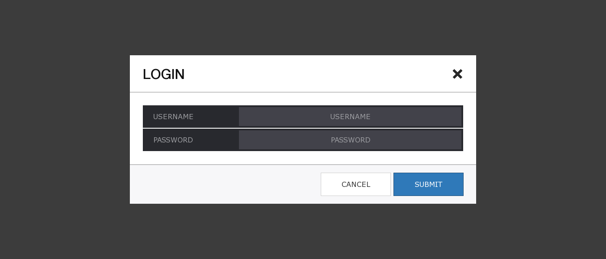
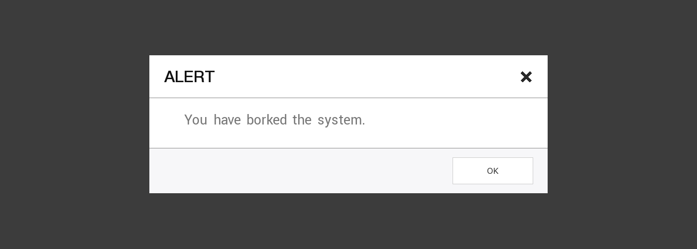
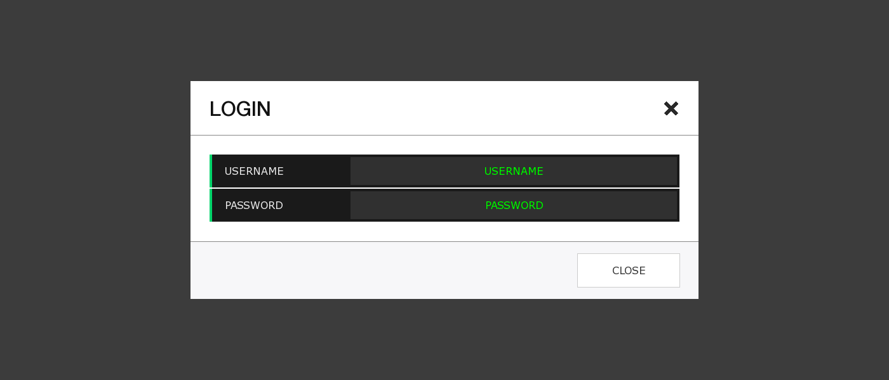
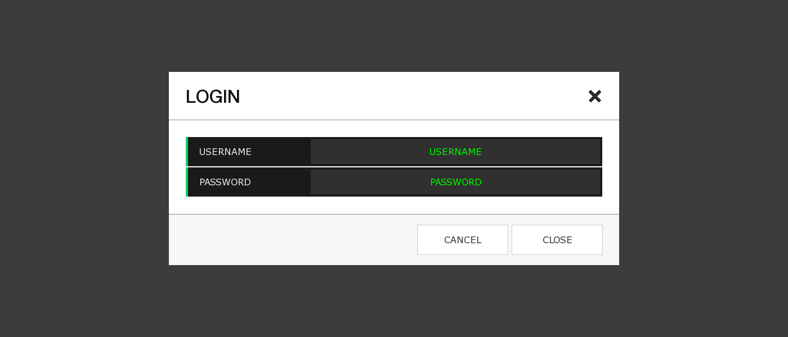
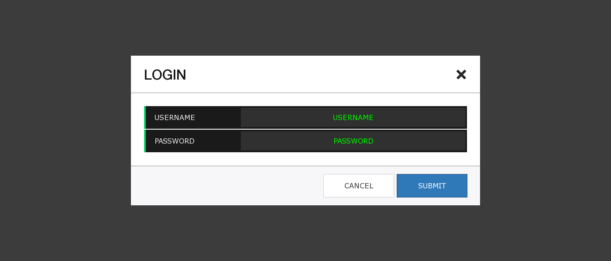

##ofxModal

A flexible and extensible kit of Modal windows for [openFrameworks](http://openframeworks.cc/).

## Installation

ofxModal is built on top of [ofxDatGui](https://github.com/braitsch/ofxDatGui) and [ofxParagraph](https://github.com/braitsch/ofxParagraph) which requires you to clone the repository recursively if you do not already have these addons installed.

	git clone --recursive git@github.com:braitsch/ofxModal.git

Once you've created a project copy the **ofxbraitsch** directory in the root of this repository to your project's bin/data directory. This directory contains the fonts & icons used by ofxModal & ofxDatGui.

## Alerts
Displaying an Alert is as simple as:

	ofxModalAlert myAlert;
	myAlert.alert("It's time to go outside.");

However it's a good idea to create a single application Alert that can be shared across multiple modal windows.

	loginModal login;
	shared_ptr<ofxModalAlert> myAlert = make_shared<ofxModalAlert>();
	login.setAlert(myAlert);
	login.addListener(this, &ofApp::onLoginEvent);
	login.show();
	
	void onLoginEvent(ofxModalEvent e)
	{
		if (e.type == ofxModalEvent::CONFIRM){
		// query your custom modal for valid user data //
			if (login.hasValidUserData() == false){
				login.alert("error! invalid credentials");
			}
		}
	}
	
This will queue the Alert to show **after** your custom modal window has closed.

## Confirms
Confirm windows are similar to Alerts except that they also give you a cancel button and can be closed by clicking the modal backdrop.

	ofxModalConfirm confirm;
	confirm.addListener(this, &ofApp::onModalEvent);
	confirm.setMessage("Are you sure you really want to do this?");
	confirm.show();
	
	void onModalEvent(ofxModalEvent e)
	{
		if (e.type == ofxModalEvent::CANCEL){
			cout << "cancel button was selected" << endl;
		else if (e.type == ofxModalEvent::CONFIRM){
			cout << "confirm button was selected" << endl;
		}
	}

## Custom Modals

Custom modals extend ofxModalWindow which gives you a window with a title, space for components and a close button.

To add components simply pass an **ofxDatGui** component to the ``addComponent`` method.

	class myLoginModal : public ofxModalWindow
	{
		public:
			myLoginModal(){
				setTitle("Login");
				addComponent(new ofxDatGuiTextInput("username", "username"));
				addComponent(new ofxDatGuiTextInput("password", "password"));
			}
	};

The window will autosize to the fit the components as you add them however you can override this by explicity setting the height via ``modal.setHeight();``

## Footer Buttons

You can add additional buttons to the footer via:

	myModal.addButton("Cancel");

Buttons are appended to the left of the button before it.

When you add a button you get back a pointer to the **ofxDatGuiButton** that was created which you can style via the [ofxDatGui API](http://braitsch.github.io/ofxDatGui/index.html#api).

However you can also retrieve a button by its zero-based index numbered from right to left.

	ofxDatGuiButton* closeButton = myModal.getButton(0);
	closeButton->setLabel("submit");
	closeButton->setLabelColor(ofColor::fromHex(0xffffff));
	closeButton->setBackgroundColors(
		ofColor::fromHex(0x337ab7),		// normal //
		ofColor::fromHex(0x286090), 	// on mouse over //
		ofColor::fromHex(0x1f4c73)		// on mouse down //
	closeButton->setBorder(ofColor::fromHex(0x1f4c73), 1);

## Events

ofxModalWindows dispatch four events:

	ofxModalEvent::SHOWN
	ofxModalEvent::HIDDEN
	ofxModalEvent::CANCEL
	ofxModalEvent::CONFIRM

	myModal.addListener(this, &ofApp::onModalEvent);

	void ofApp::onModalEvent(ofxModalEvent e)
	{
		if (e.type == ofxModalEvent::SHOWN){
		// dispatched when the window has finished animating in //
		}	else if (e.type == ofxModalEvent::HIDDEN){
		// dispatched when the window has finished animating out //
		}	else if (e.type == ofxModalEvent::CONFIRM){
		// dispatched when the button at index 0 is selected //
		}	else if (e.type == ofxModalEvent::CANCEL){
		// dispatched when the button at index 1 is selected //
		}
	}
	
You can of course bind your own handlers to any component just as you would working with **ofxDatGui**.

	ofxDatGuiButton* submitButton = myModal.getButton(0);
	ofxDatGuiButton* cancelButton = myModal.getButton(1);
	submitButton->onButtonEvent(this, &ofApp::onButtonEvent);
	cancelButton->onButtonEvent(this, &ofApp::onButtonEvent);

	void ofApp::onButtonEvent(ofxDatGuiButtonEvent e)
	{
		if (e.target == submitButton){
			cout << "submit button was clicked" << endl;
		}	else if (e.target == cancelButton){
			cout << "cancel button was clicked" << endl;
		}
	}
	
## Customization

All ofxDatGui components can be styled by either calling a specific [styling method](http://braitsch.github.io/ofxDatGui/index.html#api) or by applying an [ofxDatGuiTheme](http://braitsch.github.io/ofxDatGui/themes.html).

	ofxDatGuiThemeCharcoal guiTheme;
	addComponent(new ofxDatGuiTextInput("username", "username"))->setTheme(&guiTheme);
	addComponent(new ofxDatGuiTextInput("password", "password"))->setTheme(&guiTheme);
	// resize the components to fit the width of the modal window //
	autoSize();

Modal windows themselves can be customized by editing or extending [ofxModalTheme](https://github.com/braitsch/ofxModal/blob/master/src/ofxModalTheme.h).

## API Summary

	// public methods //
	void show();
	void hide();
	void alert(string message);
	void setWidth(int width);
	void setHeight(int height);
	void setTitle(string text);
	void setMessage(string text);
	void setMessageAlignment(ofxParagraph::Alignment align);
	void setAlert(shared_ptr<ofxModalAlert> alert);
	void setBackdropActive(bool active);
	void setTheme(shared_ptr<ofxModalTheme> theme);

	// protected methods //
	void addButton(string label);
	ofxDatGuiButton* getButton(int index);
	ofxDatGuiComponent* addComponent(ofxDatGuiComponent* component);
	void autoSize();
